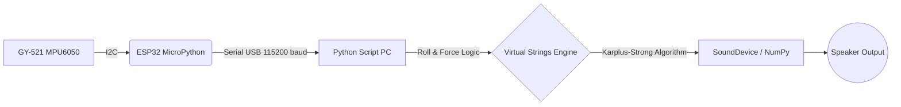

# 🎸 Air Guitar — MicroPython ESP32 Edition

<div align="center">
  
  
  <br />
  
  [](https://www.python.org)
  [](https://micropython.org)
  [](CONTRIBUTING.md)

  *Unleash your inner rockstar, no strings attached.*
</div>

---

## 🌟 About The Project

Have you ever caught yourself air-guitaring to your favorite solo? What if your invisible guitar could actually produce sound?

The **Air Guitar ESP32 Edition** is a hardware-software hybrid project that uses spatial tracking and real-time audio synthesis to turn empty air into a playable instrument. By attaching a small GY-521 (MPU6050) accelerometer to your wrist, the system tracks your hand's angle and strumming motion, translating it into rich synthesized guitar notes using the **Karplus-Strong string synthesis algorithm**.

---

## 🆕 What I Made

This project comes in **two versions:**

### Version 1 — Direct Conversion (Sensitive)
A clean, faithful conversion of the original Arduino code to MicroPython. Same logic, same math, same data format — just written in Python.
- Simple and responsive
- Can be slightly jumpy if hand isn't steady
- Good for understanding how the project works

### Version 2 — Upgraded (Improved Accuracy)
Built on Version 1 with four major upgrades to make playing feel more natural and less accidental:

| Upgrade | What it does |
|---------|-------------|
| **Low Pass Filter** | Smooths noisy sensor data so small vibrations don't count |
| **Velocity Threshold** | Ignores slow drifts — only fast intentional sweeps trigger strings |
| **Force Spike Detection** | Requires a sudden wrist snap, not just sustained force |
| **Per-String Cooldown** | Each string has its own 150ms timer to prevent rapid repeats |

> **Recommendation:** Start with Version 1 to test your setup, then switch to Version 2 for actual playing.

---

## 🧠 How It Works



1. **Hardware (ESP32):** The GY-521 measures wrist **Roll angle** and **Acceleration force**. ESP32 reads this via I2C and streams it as `ROLL:FORCE` over USB serial at 60Hz.
2. **Software (Python on PC):** The Python script decodes the serial stream and maps specific wrist angles to 6 invisible strings tuned to Open E (`Low E, A, D, G, B, High E`).
3. **Sound Synthesis:** When the wrist crosses a string's angle with enough acceleration force, the Karplus-Strong physics engine computationally plucks the string and mixes the audio in real time with a built-in limiter and distortion block.

---

## 🛠️ Requirements

### 💻 Software
- **Python 3.7+** on your PC
- Python libraries: `pyserial`, `numpy`, `sounddevice`
- **Thonny IDE** — to upload MicroPython code to ESP32

### 🔌 Hardware
- **ESP32** Development Board (30 or 38 pin)
- **GY-521** (MPU6050) Accelerometer/Gyroscope Module
- **4x Jumper Wires** (Female to Male)
- **Micro USB Cable**

---

## 🪛 Wiring Guide

Connect your GY-521 to the ESP32 as follows:

| GY-521 Pin | ESP32 Pin | Description |
|:---:|:---:|---|
| **VCC** | `3.3V` | Power — ⚠️ NOT 5V or sensor will be damaged |
| **GND** | `GND` | Ground |
| **SDA** | `GPIO 21` | I2C Data Line |
| **SCL** | `GPIO 22` | I2C Clock Line |

---

## 🚀 Setup & Installation

### Step 1 — Install Python libraries on PC
Open CMD and run:
```bash
pip install pyserial numpy sounddevice
```

### Step 2 — Install Thonny IDE
Download from [thonny.org](https://thonny.org) and install it.

### Step 3 — Flash MicroPython onto ESP32
1. Open Thonny
2. Go to **Tools → Options → Interpreter**
3. Select **MicroPython (ESP32)**
4. Select your COM port
5. Click **Install or update MicroPython**

### Step 4 — Upload main.py to ESP32
1. Open `main.py` in Thonny
2. Go to **File → Save As → MicroPython device**
3. Name it exactly `main.py` (it auto-runs on boot)
4. Test it — you should see data streaming in the Thonny shell like: `−2.31:164`

### Step 5 — Configure your COM port
Open `air_guitar.py` and update line 4:
```python
SERIAL_PORT = 'COM3'   # change to your ESP32 port
```
To find your port on Windows: **Device Manager → Ports (COM & LPT)**

### Step 6 — Run the Air Guitar
**Close Thonny first** (it locks the COM port), then open CMD and run:
```bash
python air_guitar.py
```

---

## 🎸 How to Play

1. Run `python air_guitar.py` in CMD
2. **Calibrate:** Hold your wrist flat and still for 3 seconds when prompted
3. **Rock out:**
   - **Tilt wrist left** → reach lower strings (Low E, A, D)
   - **Tilt wrist right** → reach higher strings (G, B, High E)
   - **Flick/snap wrist** forcefully to strum the string you are crossing

### Virtual String Layout

| String | Wrist Angle | Frequency |
|--------|------------|-----------|
| Low E | -40° | 82.41 Hz |
| A | -25° | 110.00 Hz |
| D | -10° | 146.83 Hz |
| G | +5° | 196.00 Hz |
| B | +20° | 246.94 Hz |
| High E | +35° | 329.63 Hz |

### Tuning Tips
If notes trigger too easily → raise these values in `air_guitar.py`:
```python
MIN_STRUM_FORCE = 140   # increase to 200-300
MIN_FORCE_SPIKE = 30    # increase to 50-80
MIN_VELOCITY    = 3.0   # increase to 5.0
```
If notes are hard to trigger → lower the same values.

---

## 🛠️ Troubleshooting

| Problem | Fix |
|---------|-----|
| `Check Serial Port!` | Close Thonny first, verify COM port number |
| `ERROR: MPU6050 not found` | Check wiring — SDA→21, SCL→22, VCC→3.3V |
| No sound at all | Check speakers, verify `sounddevice` is installed |
| Notes trigger too easily | Raise `MIN_STRUM_FORCE` and `MIN_FORCE_SPIKE` |
| Notes never trigger | Lower `MIN_STRUM_FORCE` and `MIN_FORCE_SPIKE` |
| ESP32 keeps restarting | Watchdog kicking in — check sensor wiring |

---

## 🛤️ Roadmap

- [ ] **More string options** — switch between Open E, Standard, Drop D tunings
- [ ] **Rock mode button** — one click switches to distorted rock sound profile
- [ ] **Bluetooth compatibility** — cut the USB cable, go fully wireless via ESP32 Bluetooth
- [ ] **Mobile app** — Android/iOS app to control tuning, effects, and sensitivity in real time
- [ ] **Chord support** — hold specific angles to play full chords instead of single strings
- [ ] **Visual string display** — PyGame GUI showing which string is active in real time
- [ ] **More sound effects** — overdrive, reverb, delay pedal simulation
- [ ] **Multi-instrument mode** — switch between guitar, bass, and ukulele sound profiles

---

## 🤝 Contributing

Contributions are welcome! Any improvements, bug fixes, or new features are greatly appreciated.

